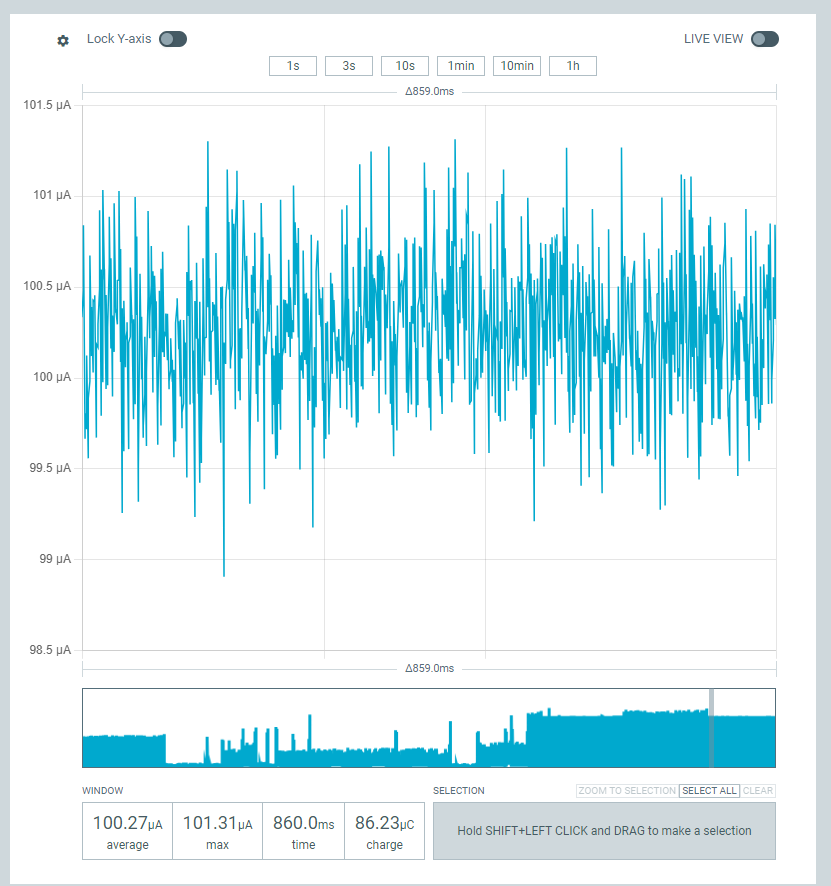

This is intended as a proof of concept / demo for achieving low power communications over Lora using Zephyr.

The code can be compiled with either `ROLE_PING` or `ROLE_PONG` defined, to control how the node behaves.

Currently, the lower power sleep I can achieve is circa 100 uA:
