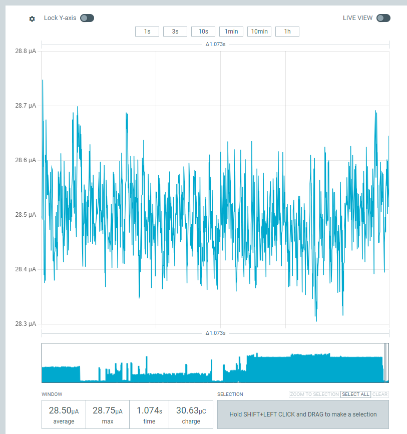

This is intended as a proof of concept / demo for achieving low power communications over Lora using Zephyr.

The code can be compiled with either `ROLE_PING` or `ROLE_PONG` defined, to control how the node behaves.

Currently, the lower power sleep I can achieve is circa 100 uA:


The important features to achieve low power (so far) have been identified as disabling USART1:
```
&usart1 {
	status = "disabled";
};
```

and being sure to enable CONFIG_PM flags:
```
# Power management
CONFIG_PM=y
CONFIG_PM_DEVICE=y
```

If we disable Lora, then we get a sleep current of closer to 28 uA:
```
CONFIG_LORA=n
```
