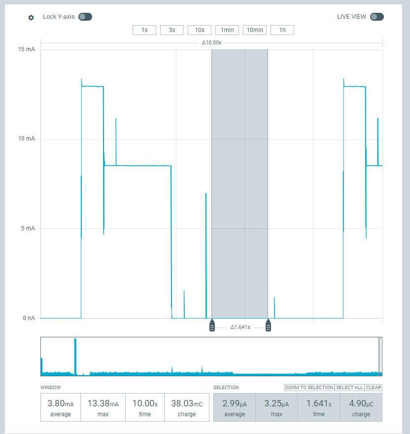

This is intended as a proof of concept / demo for achieving low power communications over Lora using Zephyr.

The code can be compiled with either `ROLE_PING` or `ROLE_PONG` defined, to control how the node behaves.

Currently, the lower power sleep I can achieve is circa 3 uA. 

Key steps for this are:
* Disconnect accessories (FTDI converter + JLink)
* Enable LORA native backend `CONFIG_LORA_MODULE_BACKEND_NATIVE=y`

This works for both `PING` and `PONG` roles, though inter-communications are not yet tested.